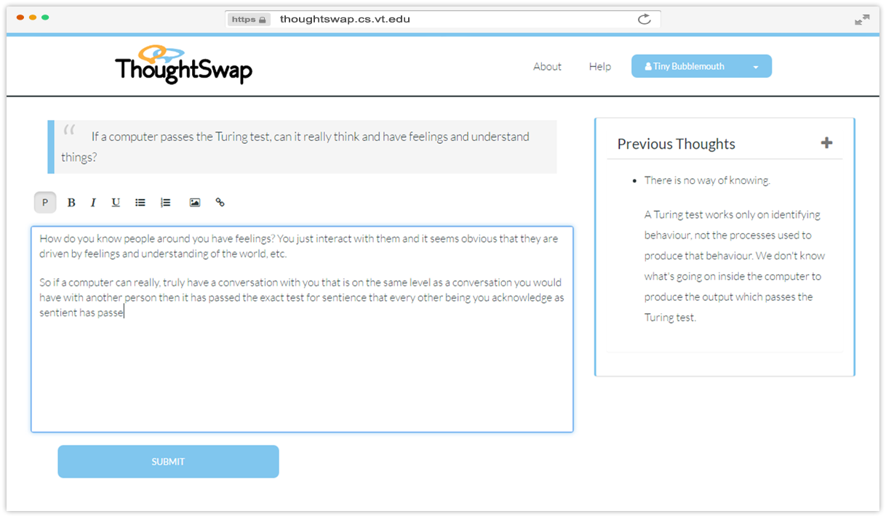
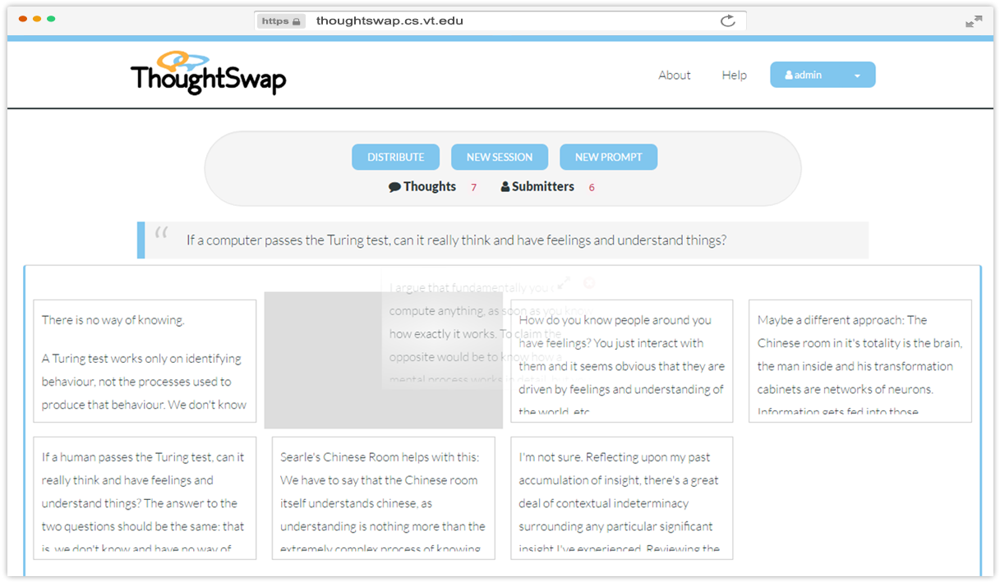

<p align="center">
  
</p>
<p align="center">
  <a href="https://github.com/prettier/prettier" target="_blank" alt="Code Style: Prettier">
    </a>
</p>

An open source web app that aims to widen and deepen the scope of participation 
in  facilitated discussions by minimizing participant self-consciousness,
social intimidation, and time pressure.

## Project in Action
ThoughtSwap is actively being tested and used at [Virginia Tech](https://vt.edu)
in classroom discussions by over 200 students. You can view the project's home 
at [thoughtswap.cs.vt.edu](http://thoughtswap.cs.vt.edu/)

For discussion facilitators, ThoughtSwap provides a platform for the creation of
groups, group sessions with prompts, and a platform to moderate and discuss 
responses. For participants it provides a platform for viewing the prompt, and
sharing their thoughts. A system of "silly name" generation for usernames and
random thought distribution helps to anonymize them from their peers.

A glimpse of this can be seen below:

### Participant View

### Facilitator View


## Contributing

For general contribution guidelines see [CONTRIBUTING](CONTRIBUTING.md). To
get started, it's as easy as following the steps below:

### Step 1: Fork
Fork the [core repository](https://github.com/VT-CHCI/Thought-Swap) and check
out your copy locally.
```bash
$ git clone git@github.com:username/Thought-Swap.git
$ cd Thought-Swap
$ git remote add upstream git://github.com/VT-CHCI/Thought-Swap.git
```

### Step 2: Install Dependencies
Ensure you have the tools needed to develop locally. Namely: 
* [Node](https://nodejs.org/en/)
* [SQL Server](https://dev.mysql.com/downloads/mysql/)
* [Sass](https://github.com/sass/dart-sass/releases)

From the root directory, setup the application by installing their dependencies:
```bash
$ npm install --prefix client
$ npm install --prefix server
```

### Step 3: Run
From the root directory, start up the app with 
```bash
$ npm run dev --prefix server
```
A browser tab will open for you at `localhost:3000`. The console you run this
command from will display output from the client and server apps and hot-reload 
whenever you make a change to either.

### Step 4: Test
Initially as a sanity check and during development as you make changes, you'll
want to run the test suites. From the root directory, the client app can be
tested via its unit tests and integration/end-to-end tests with
```bash
$ npm test --prefix client
$ npm run e2e --prefix client
```
and the server app can be tested via its unit tests with
```bash
$ npm test --prefix server
```

Additionally, JavaScript style linting is automatically provided by eslint and
dynamically re-evaluated as you make changes. Linting of any sass changes can be
run from the root directory with
```bash
$ npm run stylelint --prefix client
```

### Step 5: Development Environment
In your copy of MySQL Workbench, create a database and a user for ThoughtSwap to use. Create a file called `dev.js` in `server/config/` with the following 
content:
```js
module.exports = {
  environment: 'development',
  cookieKey: 'some_arbitrarily_generated_hash',
  databaseName: 'mysql_database_name',
  databaseUser: 'mysql_username',
  databasePassword: 'mysql_user_password'
}
```
Replace the values as needed.

<br>

## Recognitions

Thought-Swap © 2014+, Center for Human-Computer Interaction at Virginia Tech 
(VTCHCI). Released under the [MIT License](LICENSE). Special thanks to our
[contributors](https://github.com/VT-CHCI/Thought-Swap/graphs/contributors).
